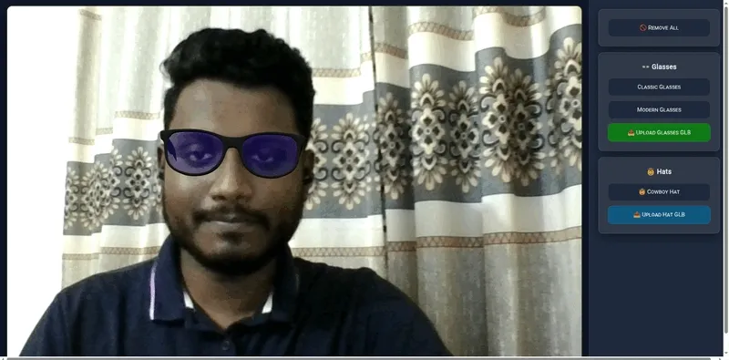
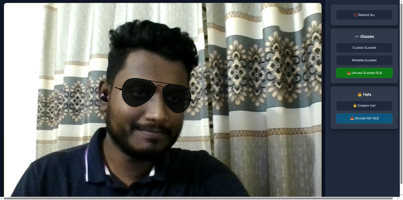
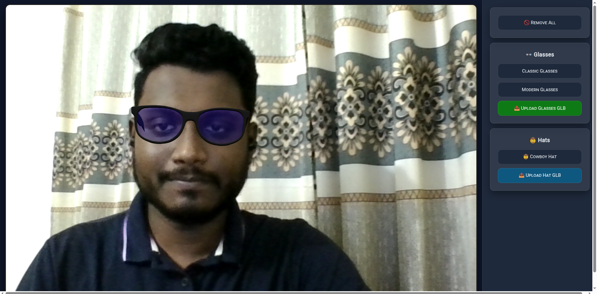
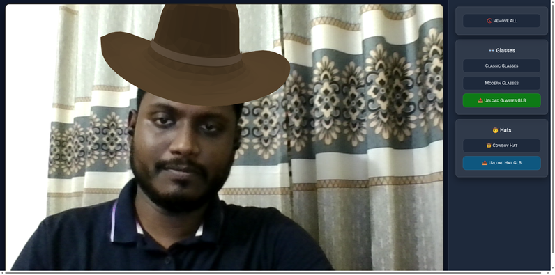
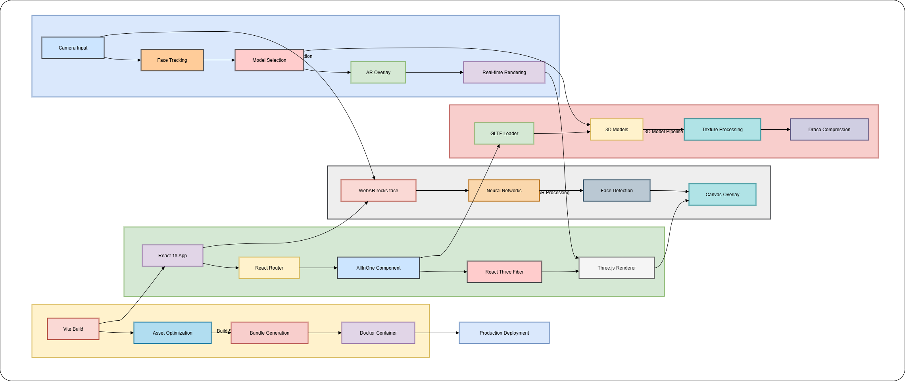

# Virtual Try-On Application

[](https://github.com/your-repo/virtual-try-on)
[](https://github.com/your-repo/virtual-try-on)
[](LICENSE)
[](https://reactjs.org/)
[](https://threejs.org/)

A cutting-edge Virtual Try-On application that enables real-time augmented reality experiences for trying on glasses and hats using advanced WebAR face tracking technology.


*Complete Virtual Try-On experience demonstration*

## Features

### Core Functionality
- **Real-time Face Tracking**: Advanced WebAR.rocks neural network-based face detection
- **3D Model Overlay**: Seamless integration of GLTF 3D models with live camera feed
- **Multi-Category Support**: Glasses and hat try-on with category-specific tracking
- **Custom Model Upload**: Support for uploading custom GLB/GLTF 3D models
- **Responsive Design**: Optimized for desktop, tablet, and mobile devices

### Technical Highlights
- **WebGL Acceleration**: Hardware-accelerated 3D rendering with Three.js
- **Neural Network Processing**: Client-side AI for face landmark detection
- **Post-Processing Effects**: Bloom and visual enhancement effects
- **Memory Management**: Efficient cleanup and resource management
- **Progressive Loading**: Optimized asset loading with compression

### User Experience
- **Intuitive Interface**: Clean, modern UI with easy navigation
- **Real-time Performance**: 30+ FPS rendering on modern devices
- **Cross-Platform**: Works on all modern browsers with camera support
- **Accessibility**: Keyboard navigation and screen reader support

## Application Screenshots

### Main Interface

*Clean, modern interface with camera view and control panels*

### Glasses Try-On Feature

*Real-time glasses overlay with accurate face tracking*

### Hat Try-On Feature

*Virtual hat try-on with 3D model positioning*

### Complete Workflow

*End-to-end user experience from selection to try-on*

## Technology Stack

### Frontend Framework
- **React 18.3.1**: Modern functional components with hooks
- **React Router DOM 7.1.3**: Client-side routing and navigation
- **Vite 6.0.5**: Fast development server and optimized builds

### 3D Graphics & WebAR
- **Three.js 0.172.0**: 3D graphics library and WebGL wrapper
- **React Three Fiber 8.18.0**: React renderer for Three.js
- **WebAR.rocks.face**: Advanced face tracking and AR capabilities
- **GLTF Loader**: 3D model loading with Draco compression support

### Post-Processing & Effects
- **@react-three/postprocessing 2.19.1**: Visual effects pipeline
- **Bloom Effects**: Realistic lighting and glow effects
- **Custom Shaders**: Optimized rendering for AR overlay

### Build & Development
- **ESLint 9.17.0**: Code quality and consistency
- **Docker**: Containerized deployment with Nginx
- **Multi-stage Builds**: Optimized production containers

## Quick Start

### Prerequisites
- Node.js 18+ and npm
- Modern browser with camera support
- WebGL-compatible device

### Installation

1. **Clone the repository**
   ```bash
   git clone https://github.com/your-repo/virtual-try-on.git
   cd virtual-try-on
   ```

2. **Install dependencies**
   ```bash
   npm install
   ```

3. **Start development server**
   ```bash
   npm run dev
   ```

4. **Open in browser**
   ```
   http://localhost:5173
   ```

### Camera Permissions
The application requires camera access for face tracking. When prompted:
1. Click "Allow" when browser requests camera permission
2. Ensure good lighting for optimal face detection
3. Position face within the camera frame


*Application interface with camera setup and face tracking*

## Usage Guide

### Basic Try-On Experience

1. **Launch Application**: Navigate to the application URL
2. **Grant Camera Access**: Allow browser camera permissions
3. **Wait for Initialization**: WebAR system loads neural networks
4. **Select Product**: Choose from glasses or hat categories
5. **Try On**: 3D model overlays on detected face in real-time


*Virtual glasses try-on with real-time face tracking*


*Virtual hat try-on demonstration*

### Custom Model Upload

1. **Prepare 3D Model**: Ensure GLB format with proper scaling
2. **Click Upload Button**: Select file from glasses or hat section
3. **Wait for Processing**: Model loads and validates
4. **Try On**: Uploaded model appears in product list

### Supported File Formats
- **GLB**: Binary GLTF format (recommended)
- **GLTF**: Text-based format with external assets
- **Textures**: PNG, JPG, WebP formats
- **Compression**: Draco geometry compression supported

## Architecture Overview


*Complete system architecture and component relationships*

### Component Structure
```
src/
├── js/
│   ├── components/
│   │   ├── VTOButton.jsx       # Styled button component
│   │   └── SimpleMenu.jsx      # Menu navigation
│   └── demos/
│       └── AllInOne.jsx        # Main VTO application
├── assets/                     # 3D models and textures
└── index.css                   # Global styles and themes
```

### Data Flow
```
Camera Input → WebAR Face Detection → Three.js Rendering → Canvas Display
                                   ↓
              GLTF Model Loading ← Product Selection Interface
```

### WebAR Integration
- **Neural Networks**: NN_GLASSES and NN_HAT for category-specific tracking
- **Face Landmarks**: Real-time detection of facial features
- **Pose Estimation**: 3D head orientation and positioning
- **Occlusion Handling**: Proper depth sorting for realistic overlay

## Development

### Project Structure
```
virtual-try-on/
├── public/
│   ├── contrib/                # WebAR.rocks libraries
│   └── draco/                  # Draco compression decoder
├── src/
│   ├── js/                     # React components
│   ├── assets/                 # 3D models and textures
│   └── main.jsx                # Application entry point
├── Dockerfile                  # Container configuration
└── vite.config.js             # Build configuration
```

### Available Scripts

```bash
# Development
npm run dev          # Start development server
npm run build        # Build for production
npm run preview      # Preview production build
npm run lint         # Run ESLint code analysis

# Docker
docker build -t vto-app .
docker run -p 8080:80 vto-app
```

### Environment Configuration

**Development**
- Hot module replacement
- Source maps enabled
- Debug logging active

**Production**
- Minified bundles
- Asset optimization
- Service worker caching

## Deployment

### Vercel (Recommended)
```bash
# Install Vercel CLI
npm i -g vercel

# Deploy
vercel --prod
```

### Docker Deployment
```bash
# Build image
docker build -t virtual-try-on .

# Run container
docker run -d -p 8080:80 virtual-try-on

# Access application
open http://localhost:8080
```

### Static Hosting
```bash
# Build static files
npm run build

# Deploy dist/ folder to:
# - Netlify
# - GitHub Pages
# - AWS S3 + CloudFront
# - Any static hosting service
```

## Browser Compatibility

### Supported Browsers
- **Chrome 90+**: Full WebAR and WebGL support
- **Firefox 88+**: Complete functionality
- **Safari 14+**: iOS and macOS support
- **Edge 90+**: Windows compatibility

### Required Features
- WebGL 2.0 support
- MediaDevices.getUserMedia() API
- ES2020 JavaScript features
- WebAssembly support

### Performance Requirements
- **Minimum**: 2GB RAM, integrated graphics
- **Recommended**: 4GB+ RAM, dedicated GPU
- **Mobile**: iOS 12+, Android 8+ with WebGL

## Performance Optimization

### 3D Model Guidelines
- **File Size**: Keep GLB files under 5MB
- **Polygon Count**: Maximum 10,000 triangles
- **Texture Resolution**: 1024x1024 or smaller
- **Compression**: Use Draco geometry compression

### Rendering Optimization
- **Adaptive Quality**: Automatic quality adjustment based on device
- **LOD System**: Multiple detail levels for different distances
- **Frustum Culling**: Only render visible objects
- **Texture Streaming**: Progressive texture loading

## Troubleshooting

### Common Issues

**Camera Not Working**
- Check browser permissions in settings
- Ensure HTTPS connection (required for camera access)
- Try different browser or device
- Verify camera is not used by other applications

**Poor Face Tracking**
- Improve lighting conditions
- Position face directly in front of camera
- Remove glasses or hats that obstruct face
- Ensure stable internet connection for neural network loading

**3D Model Issues**
- Verify GLB file format and integrity
- Check model scale and positioning
- Ensure textures are embedded in GLB file
- Validate file size is under upload limit

**Performance Problems**
- Close other browser tabs and applications
- Update graphics drivers
- Try lower quality settings
- Use Chrome for best WebGL performance

### Debug Mode
Enable debug logging in browser console:
```javascript
localStorage.setItem('debug', 'vto:*');
```

## Contributing

### Development Setup
1. Fork the repository
2. Create feature branch: `git checkout -b feature/amazing-feature`
3. Install dependencies: `npm install`
4. Start development server: `npm run dev`
5. Make changes and test thoroughly
6. Run linting: `npm run lint`
7. Commit changes: `git commit -m 'Add amazing feature'`
8. Push to branch: `git push origin feature/amazing-feature`
9. Open Pull Request

### Code Standards
- Follow ESLint configuration
- Use functional React components with hooks
- Implement proper error handling
- Add comments for complex logic
- Maintain responsive design principles

### Testing Guidelines
- Test on multiple browsers and devices
- Verify camera functionality
- Check 3D model loading and rendering
- Validate responsive design breakpoints
- Test file upload functionality

## License

This project is licensed under the MIT License - see the [LICENSE](LICENSE) file for details.

## Acknowledgments

- **WebAR.rocks**: Advanced face tracking technology
- **Three.js Community**: 3D graphics framework and ecosystem
- **React Team**: Modern frontend framework
- **Draco**: 3D geometry compression library

## Support

For support and questions:
- Create an issue on GitHub
- Check existing documentation
- Review troubleshooting section
- Contact development team

---

**Built with ❤️ using React, Three.js, and WebAR technology**
